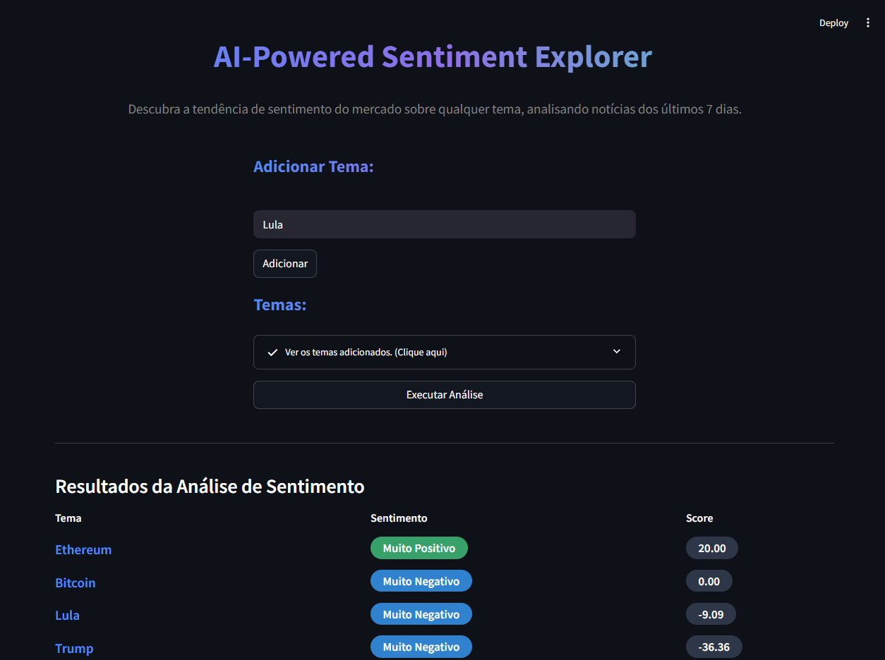

<p align="center">
    <a href="https://www.python.org/downloads/release/python-3100/">
        
    </a>
    <a href="https://fastapi.tiangolo.com/">
        
    </a>
    <a href="https://docs.streamlit.io/">
        
    </a>
    <a href="https://huggingface.co/models">
        .svg?logo=huggingface&logoColor=white" alt="AI Model"/>
    </a>
    <a href="https://github.com/seu-usuario/dataanalysis/releases/tag/v1.0">
        
    </a>
</p>

<p align="center">
    
</p>

# 🚀 AI-Powered Sentiment Explorer

## 📚 Sumário

- [🧠 Sobre a Tecnologia](#-sobre-a-tecnologia)
- [✨ Funcionalidades](#-funcionalidades)
- [🖥️ Requisitos Mínimos de Hardware](#️-requisitos-mínimos-de-hardware)
- [🛠️ Requisitos de Software](#️-requisitos-de-software)
- [⚡ Tempo Estimado de Inicialização dos Containers](#-tempo-estimado-de-inicialização-dos-containers)
- [🚦 Instalação e Execução](#-instalação-e-execução)
- [🔗 Como Realizar Requisições Diretas na API](#-como-realizar-requisições-diretas-na-api)
- [📁 Estrutura do Projeto](#-estrutura-do-projeto)
- [🤝 Como Contribuir](#-como-contribuir)
- [📄 Licença](#-licença)
- [📬 Contato](#-contato)

---

## 🧠 Sobre a Tecnologia

Este projeto utiliza técnicas avançadas de **Processamento de Linguagem Natural (NLP)** para analisar automaticamente o sentimento de textos extraídos de notícias. O NLP permite identificar emoções, opiniões e tendências em grandes volumes de dados, fornecendo insights rápidos e precisos sobre qualquer tema escolhido pelo usuário.

---

## ✨ Funcionalidades

- ➕ Adição dinâmica de temas para análise
- 📊 Visualização dos resultados em tabela e TreeMap
- 📰 Análise de sentimento baseada em notícias dos últimos 7 dias
- 💻 Interface moderna e responsiva
- 🐳 Deploy via Docker Compose (API + App)

---

## 🖥️ Requisitos Mínimos de Hardware

 - **CPU:** ⚡ Dual-core 2.0 GHz ou superior
 - **Memória RAM:** 💾 2 GB (recomendado 4 GB para uso confortável)
 - **Armazenamento:** 📦 Pelo menos 24 GB livres (1.75 GB para a imagem da aplicação e 21.8 GB para a imagem da API)
 - **Rede:** 🌐 Conexão para baixar notícias, dependências e imagens Docker

---

## 🛠️ Requisitos de Software

- 🐳 Docker e Docker Compose instalados(ou 🐍 Python 3.8+ com [Poetry](https://python-poetry.org/) para execução local)
- 🌎 Navegador web moderno

---

## ⚡ Tempo Estimado de Inicialização dos Containers

O tempo para subir cada container depende do hardware, conexão de internet e do tempo de instalação das bibliotecas Python especificadas nos arquivos Dockerfile. Abaixo estão estimativas considerando a primeira execução (quando as dependências ainda não estão em cache):

- **App (Interface)**⏱️ Aproximadamente **30 a 90 segundos**
- **API (IA)**
  ⏱️ Aproximadamente **40 a 120 segundos**

> 💡 *Na primeira execução, o tempo é maior devido ao download das imagens base do Docker e à instalação das dependências. Nas execuções seguintes, com as imagens já em cache, o tempo de inicialização cai para menos de 10 segundos por serviço.*

---

## 🚦 Instalação e Execução

### Usando Docker Compose (Recomendado)

1. 🌀 Clone este repositório:

   ```bash
   git clone https://github.com/miguelssouza/AI/sentimentexplorer.git
   ```
2. ▶️ Execute os containers:

   ```bash
   docker-compose up --build
   ```
3. 🌐 Acesse a aplicação:

   - Interface Web: [http://localhost:8501](http://localhost:8501)
   - API: [http://localhost:8000](http://localhost:8000)

---

### Execução Local (Desenvolvedores)

1. 🐍 Instale o Python 3.8+ e o [Poetry](https://python-poetry.org/).
2. 📦 Instale as dependências:
   ```bash
   cd app
   poetry install
   ```
3. ▶️ Execute a aplicação:
   ```bash
   poetry run streamlit run app.py
   ```

---

## 🔗 Como Realizar Requisições Diretas na API

Você pode interagir diretamente com a API utilizando ferramentas como [curl](https://curl.se/), [httpie](https://httpie.io/), [Postman](https://www.postman.com/) ou qualquer biblioteca HTTP em Python (ex: `requests`).

### 📥 Exemplo de Requisição (POST)

Supondo que a API esteja rodando em [http://localhost:8000](http://localhost:8000):

#### Usando `curl`:

```bash
curl -X POST "http://localhost:8000/analyze" \
     -H "Content-Type: application/json" \
     -d '{"text": "O Bitcoin está subindo e o mercado está otimista!"}'
```
---

## 📁 Estrutura do Projeto

```plaintext
sentimentexplorer/
│
├── app/                  # Código da aplicação Streamlit
│   ├── [__init__.py](http://_vscodecontentref_/2)
│   ├── [app.py](http://_vscodecontentref_/3)            # Arquivo principal da aplicação
│   ├── components/       # Componentes reutilizáveis
│   └── ...               # Outros arquivos
│
├── api/                  # Código da API FastAPI
│   ├── [app.py](http://_vscodecontentref_/4)
│   └── ...
├── [docker-compose.yml](http://_vscodecontentref_/5)    # Configuração do Docker Compose
├── [Dockerfile.api](http://_vscodecontentref_/6)        # Dockerfile para a API
└── [Dockerfile.app](http://_vscodecontentref_/7)        # Dockerfile para a aplicação Streamlit
```

---

## 🤝 Como Contribuir

1. 🍴 Faça um fork deste repositório.
2. 🌱 Crie uma branch para sua feature: `git checkout -b minha-feature`
3. 💡 Faça suas alterações e commit: `git commit -m 'Minha nova feature'`
4. 🚀 Envie para o seu fork: `git push origin minha-feature`
5. 📬 Abra um Pull Request neste repositório.

---

## 📄 Licença

Este projeto está licenciado sob a licença MIT. Veja o arquivo [LICENSE](vscode-file://vscode-app/c:/Users/migue/AppData/Local/Programs/Microsoft%20VS%20Code/resources/app/out/vs/code/electron-sandbox/workbench/workbench.html) para mais detalhes.

---

## 📬 Contato

* **Seu Nome** - [Miguel Santos (MSAI)](vscode-file://vscode-app/c:/Users/migue/AppData/Local/Programs/Microsoft%20VS%20Code/resources/app/out/vs/code/electron-sandbox/workbench/workbench.html)
* **GitHub:** [@miguelssouza](vscode-file://vscode-app/c:/Users/migue/AppData/Local/Programs/Microsoft%20VS%20Code/resources/app/out/vs/code/electron-sandbox/workbench/workbench.html)

Agradecemos o seu interesse em contribuir para o  **AI-Powered Sentiment Explorer** ! 💙🚀

---